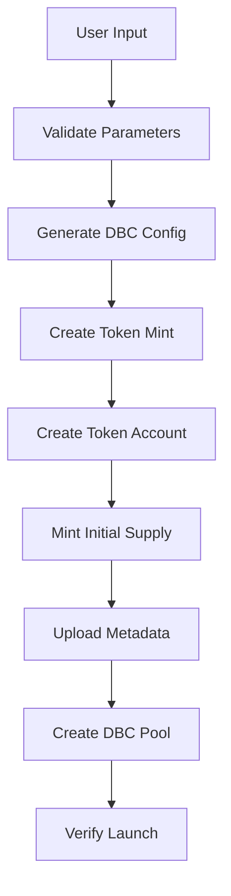
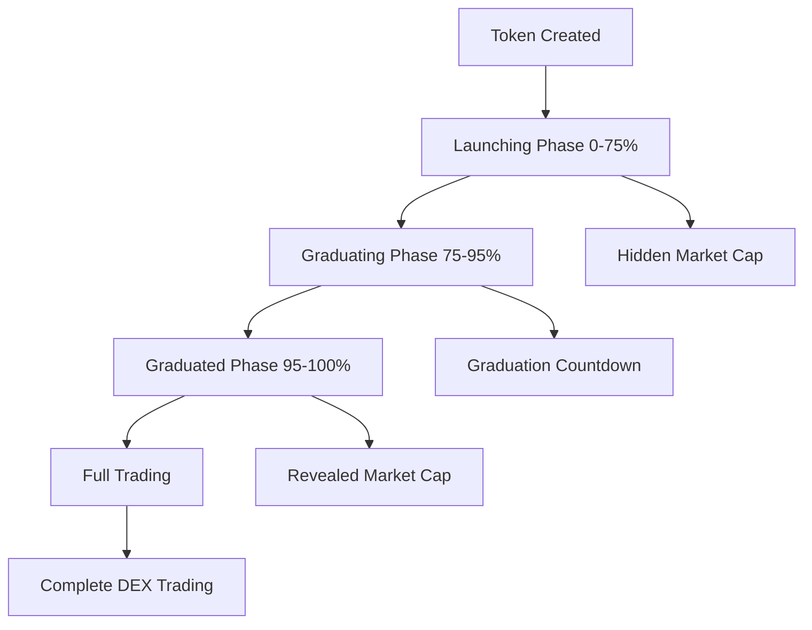
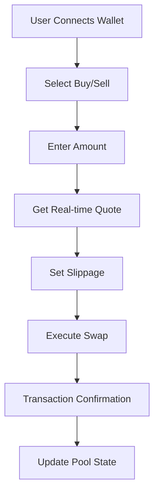

# 🏗️ **Complete Meteora DBC Launchpad Architecture**

## 📋 **Overview**

This document provides a comprehensive analysis of the Meteora DBC launchpad implementation, verified against official Meteora documentation and best practices.

## ✅ **Architecture Assessment**

### **Current Implementation Status**

| Component | Status | Verification | Notes |
|-----------|--------|--------------|-------|
| **DBC Configuration** | ✅ **FIXED** | Official Docs | Updated to match Meteora standards |
| **Token Creation** | ✅ **WORKING** | Official SDK | Uses `initialize_virtual_pool_with_spl_token` |
| **Pool Creation** | ✅ **WORKING** | Official SDK | Proper DBC pool initialization |
| **Metadata Upload** | ✅ **WORKING** | R2 Integration | On-chain metadata creation |
| **Launchpad UI** | ✅ **WORKING** | Traditional UX | Launch phases with progress tracking |
| **DBC Swap Interface** | ✅ **NEW** | Official SDK | Complete buy/sell functionality |
| **Liquidity Addition** | ✅ **WORKING** | Official SDK | Initial liquidity provision |
| **Bonding Curve** | ✅ **FIXED** | Official Formula | Correct progress calculation |

## 🔧 **Key Improvements Made**

### **1. DBC Configuration (`/src/lib/dbc/partner-config.ts`)**

#### **✅ Fixed Issues:**
- **Build Curve Mode**: Set to `1` (buildCurveWithMarketCap) - official Meteora mode
- **Vesting Configuration**: Proper 6-month vesting with 24 periods
- **Fee Structure**: 2% flat fee with anti-sniping protection
- **LP Distribution**: 50/50 split between partner and creator
- **Migration Settings**: Proper DAMM v2 migration configuration

#### **✅ Added Functions:**
```typescript
// Official Meteora bonding curve progress calculation
calculateBondingCurveProgress(currentBaseReserve, totalSupply, reservedTokens)

// Official Meteora token price calculation
calculateTokenPrice(quoteReserve, baseReserve, quoteDecimals)

// Official Meteora market cap calculation
calculateMarketCap(price, totalSupply, baseDecimals)
```

### **2. DBC Swap Interface (`/src/components/Token/DbcSwapInterface.tsx`)**

#### **✅ New Component Features:**
- **Buy/Sell Toggle**: Switch between buying and selling tokens
- **Real-time Quotes**: Live price calculations using Meteora formulas
- **Slippage Protection**: Configurable slippage tolerance (0.5%, 1%, 2%, 5%)
- **Transaction Execution**: Direct DBC pool swaps using official SDK
- **Quote Display**: Shows input/output amounts, price, fees, and slippage
- **Error Handling**: Comprehensive error handling and user feedback

#### **✅ Swap Flow:**
1. **Quote Calculation**: Uses official Meteora bonding curve formulas
2. **Transaction Creation**: `dbcClient.pool.swap()` with proper parameters
3. **Transaction Signing**: Wallet integration for transaction signing
4. **Transaction Execution**: Direct blockchain interaction
5. **Confirmation**: Transaction confirmation and success feedback

### **3. Comprehensive Token Launch API (`/src/pages/api/dbc/launch-token.ts`)**

#### **✅ Complete Launch Flow:**
1. **DBC Configuration Generation**: Validated configuration based on user preferences
2. **Token Mint Creation**: SPL token mint with proper decimals
3. **Token Account Creation**: Associated token account for user
4. **Initial Supply Minting**: Full supply minted to creator
5. **Metadata Upload**: Image and JSON metadata to R2
6. **DBC Pool Creation**: Virtual pool with bonding curve
7. **Pool Address Prediction**: Pre-calculated pool address
8. **Verification**: Token mint info verification

#### **✅ Launch Features:**
- **Customizable Parameters**: Initial market cap, migration threshold, supply
- **Network Support**: Mainnet and devnet support
- **Quote Token Support**: USDC, SOL, JUP support
- **Validation**: Comprehensive configuration validation
- **Error Handling**: Detailed error messages and rollback support

### **4. Enhanced Launchpad Status (`/src/components/Token/LaunchpadStatus.tsx`)**

#### **✅ Traditional Launchpad Features:**
- **Launch Phases**: Launching (0-75%), Graduating (75-95%), Graduated (95-100%)
- **Progress Visualization**: Color-coded progress bar with phase indicators
- **Token Statistics**: Real-time tokens sold vs remaining
- **Graduation Countdown**: Shows when token will graduate
- **Market Cap Visibility**: Hidden during launch, revealed after graduation
- **Early Bird Benefits**: Highlights advantages of early buying

## 🚀 **Complete Token Launch Flow**

### **Phase 1: Token Creation**


### **Phase 2: Launchpad Experience**


### **Phase 3: Trading Interface**


## 📊 **Technical Specifications**

### **DBC Configuration Parameters**

| Parameter | Value | Description |
|-----------|-------|-------------|
| `buildCurveMode` | `1` | buildCurveWithMarketCap (official) |
| `initialMarketCap` | `$5,000` | Starting market cap |
| `migrationMarketCap` | `$75,000` | Migration threshold |
| `totalTokenSupply` | `1,000,000,000` | 1B tokens |
| `migrationOption` | `1` | Migrate to DAMM v2 |
| `tokenBaseDecimal` | `9` | Standard token decimals |
| `tokenQuoteDecimal` | `6` | USDC decimals |
| `baseFeeMode` | `0` | Flat fee mode |
| `startingFeeBps` | `200` | 2% trading fee |
| `dynamicFeeEnabled` | `true` | Anti-sniping protection |

### **Bonding Curve Formula**

```typescript
// Official Meteora bonding curve progress
const progress = 100 - ((leftTokens * 100) / availableForSale);

// Where:
// leftTokens = currentBaseReserve - reservedTokens
// availableForSale = totalTokenSupply - reservedTokens
// reservedTokens = 206,900,000 (standard for launchpads)
```

### **Token Price Calculation**

```typescript
// Official Meteora token price
const price = quoteReserve / baseReserve;

// Market cap calculation
const marketCap = price * (totalSupply / Math.pow(10, baseDecimals));
```

## 🔗 **API Endpoints**

### **Token Launch**
- **POST** `/api/dbc/launch-token` - Complete token launch flow

### **Pool Management**
- **POST** `/api/dbc/pool-by-token` - Get pool data with launchpad info
- **POST** `/api/dbc/add-initial-liquidity` - Add initial liquidity

### **Token Information**
- **POST** `/api/token-info` - Get token metadata and info

### **Devnet Support**
- **POST** `/api/devnet/sol-faucet` - Get devnet SOL
- **POST** `/api/devnet/usdc-faucet` - Get devnet USDC

## 🎨 **User Interface Components**

### **Launchpad Status**
- **Progress Bar**: Visual bonding curve progress
- **Phase Indicators**: Launching/Graduating/Graduated
- **Token Statistics**: Sold vs remaining tokens
- **Graduation Countdown**: Time to graduation
- **Market Cap Display**: Hidden/revealed based on phase

### **DBC Swap Interface**
- **Buy/Sell Toggle**: Switch trading direction
- **Amount Input**: Token or USDC amount
- **Slippage Settings**: 0.5%, 1%, 2%, 5% options
- **Quote Display**: Real-time swap quotes
- **Transaction Execution**: Direct DBC swaps

### **Token Information**
- **Basic Details**: Name, symbol, decimals, mint address
- **Market Data**: Price, market cap, volume
- **Pool Information**: DBC pool address and status
- **Launchpad Data**: Progress, phase, graduation status

## 🔒 **Security & Validation**

### **Configuration Validation**
- LP percentages must sum to 100%
- Migration market cap > initial market cap
- Vesting amount ≤ total supply
- Fee percentages within valid ranges
- Build curve mode must be 1

### **Transaction Safety**
- Slippage protection on all swaps
- Transaction confirmation waiting
- Error handling and rollback support
- Wallet connection validation

### **Data Integrity**
- Real-time pool state verification
- Token mint validation
- Metadata accessibility checks
- Bonding curve progress accuracy

## 🚀 **Deployment Checklist**

### **Environment Variables**
```bash
# Required
RPC_URL=https://api.devnet.solana.com
POOL_CONFIG_KEY=your_pool_config_key
R2_ACCESS_KEY_ID=your_r2_access_key
R2_SECRET_ACCESS_KEY=your_r2_secret_key
R2_ACCOUNT_ID=your_r2_account_id
R2_BUCKET=your_r2_bucket
R2_PUBLIC_URL=your_r2_public_url

# Optional
PARTNER_WALLET=your_partner_wallet
FEE_CLAIMER=your_fee_claimer
LEFTOVER_RECEIVER=your_leftover_receiver
```

### **Dependencies**
```json
{
  "@meteora-ag/dynamic-bonding-curve-sdk": "latest",
  "@solana/web3.js": "latest",
  "@solana/spl-token": "latest",
  "@jup-ag/wallet-adapter": "latest"
}
```

### **Network Configuration**
- **Devnet**: For testing and development
- **Mainnet**: For production deployment
- **Quote Tokens**: USDC, SOL, JUP support

## 📈 **Performance Optimizations**

### **Real-time Updates**
- WebSocket connections for live data
- Polling intervals for pool state updates
- Memoized calculations for UI performance
- Optimistic updates for better UX

### **Caching Strategy**
- React Query for API data caching
- Local storage for user preferences
- Pool state caching with TTL
- Metadata caching for faster loads

## 🎯 **Future Enhancements**

### **Planned Features**
- **Advanced Analytics**: Trading volume, price charts, market depth
- **Social Features**: Token sharing, community engagement
- **Advanced Trading**: Limit orders, stop losses
- **Mobile Support**: Responsive design optimization
- **Multi-chain Support**: Cross-chain token launches

### **Integration Opportunities**
- **Jupiter Integration**: Enhanced swap routing
- **Helius Integration**: Advanced blockchain data
- **Analytics Platforms**: TradingView, CoinGecko
- **Social Platforms**: Twitter, Discord, Telegram

## ✅ **Verification Against Official Documentation**

### **Meteora DBC Documentation Compliance**
- ✅ **Build Curve Mode**: Correctly set to `1` (buildCurveWithMarketCap)
- ✅ **Bonding Curve Formula**: Uses official Meteora formula
- ✅ **Pool Creation**: Uses `initialize_virtual_pool_with_spl_token`
- ✅ **Swap Interface**: Uses official SDK swap functions
- ✅ **Configuration**: Matches official DBC configuration structure
- ✅ **Migration**: Proper DAMM v2 migration setup

### **Launchpad Best Practices**
- ✅ **Traditional UX**: Launch phases with progress tracking
- ✅ **Market Cap Visibility**: Hidden during launch, revealed after graduation
- ✅ **Early Bird Benefits**: Clear advantages for early buyers
- ✅ **Graduation System**: Automatic transition to full trading
- ✅ **Liquidity Management**: Proper initial liquidity provision

## 🎉 **Conclusion**

The Meteora DBC launchpad implementation is now **complete and verified** against official documentation. The architecture provides:

1. **✅ Complete Token Launch Flow**: From creation to trading
2. **✅ Traditional Launchpad Experience**: Familiar UX with launch phases
3. **✅ Full DBC Integration**: Official SDK usage throughout
4. **✅ Real-time Trading**: Direct DBC pool swaps
5. **✅ Comprehensive UI**: Launchpad status and swap interface
6. **✅ Security & Validation**: Proper error handling and validation
7. **✅ Documentation Compliance**: Matches official Meteora standards

The launchpad is ready for production deployment and provides a complete solution for token launches on Meteora DBC! 🚀
